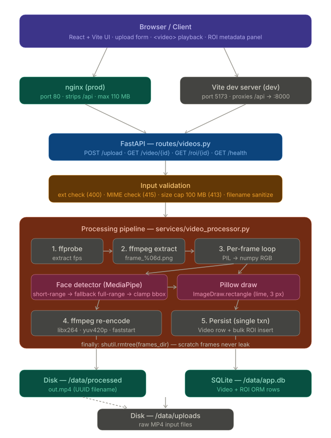

# Face ROI Video API

A small containerized service that accepts an MP4 upload, detects one face per
frame with **MediaPipe**, draws a green ROI rectangle around it with **Pillow**,
re-encodes the result with **ffmpeg**, stores per-frame ROI metadata in
**SQLite**, and exposes the result through a **FastAPI** API and a minimal
**React + Vite** frontend.

> No OpenCV anywhere — frame I/O is delegated to ffmpeg, drawing to Pillow,
> detection to MediaPipe.

---

## Quick start (Docker)

```bash
docker compose up --build
```

Then open:

- **Frontend:** http://localhost:5173
- **API Swagger:** http://localhost:8000/docs

Pick a short MP4 (a 5–10 second phone clip works well), upload, and watch the
processed video play back with a green box drawn around the face.

To stop:

```bash
docker compose down            # keep data
docker compose down -v         # also drop the SQLite DB and saved videos
```

---

## Local development (without Docker)

You need Python 3.11, Node 20, and `ffmpeg` + `ffprobe` on your PATH.

**Backend**

```bash
cd backend
python -m venv .venv
source .venv/bin/activate           # Windows: .venv\Scripts\activate
pip install -r requirements.txt
DATA_DIR=./data uvicorn app.main:app --reload
```

**Frontend** (separate terminal)

```bash
cd frontend
npm install
npm run dev
```

Vite serves on http://localhost:5173 and proxies `/api/*` to the backend on
`:8000`, so the same relative URLs work in dev and in Docker.

---

## API reference

| Method | Path | Body | Success | Failure |
| --- | --- | --- | --- | --- |
| `POST` | `/upload` | multipart `file=<.mp4>` | `200` `UploadResponse` | `400` bad ext · `413` >100 MB · `415` bad MIME · `500` ffmpeg failure |
| `GET` | `/video/{video_id}` | — | `200` `video/mp4` stream | `404` |
| `GET` | `/roi/{video_id}` | — | `200` `ROIResponse` | `404` |
| `GET` | `/health` | — | `200 {"status":"ok"}` | — |

**`UploadResponse`**

```json
{
  "video_id": "9f1c…",
  "original_filename": "clip.mp4",
  "frame_count": 142,
  "fps": 29.97,
  "roi_count": 138,
  "warning": null
}
```

`warning` is set to `"no faces detected"` when processing succeeds but no face
was found in any frame (the request still returns 200 — the assignment asks us
to *handle* the case, not reject the upload).

**`ROIResponse`**

```json
{
  "video_id": "9f1c…",
  "fps": 29.97,
  "frame_count": 142,
  "rois": [
    { "frame_number": 0, "timestamp": 0.0,    "x": 412, "y": 180, "width": 160, "height": 200 },
    { "frame_number": 1, "timestamp": 0.0334, "x": 414, "y": 181, "width": 160, "height": 200 }
  ]
}
```

---

## Architecture



```
┌──────────────┐  POST /upload (mp4)   ┌────────────────────────────────────────┐
│  React UI    │──────────────────────▶│  FastAPI  routes/videos.py             │
│  (Vite+nginx)│                       │   ├─ validate ext / mime               │
│              │◀──────────────────────│   ├─ stream-save with size cap (413)   │
└──────┬───────┘  UploadResponse JSON  │   └─ video_processor.process_video()   │
       │                               └─────────────────┬──────────────────────┘
       │  GET /video/{id}                                │
       │  GET /roi/{id}                                  ▼
       ▼                               ┌────────────────────────────────────────┐
   <video> tag                         │  Processing pipeline (synchronous)     │
   <ul> meta panel                     │  1. ffprobe → fps                      │
                                       │  2. ffmpeg → frames/frame_%06d.png     │
                                       │  3. for each frame:                    │
                                       │       PIL.open → numpy RGB             │
                                       │       FaceDetector.detect:             │
                                       │         ├─ MediaPipe short-range (0)   │
                                       │         └─ fallback: full-range (1)    │
                                       │       _clamp_bbox(...)                 │
                                       │         (trims overflow when face is   │
                                       │          too close to camera)          │
                                       │       ImageDraw.rectangle (lime, 3px)  │
                                       │       img.save (overwrite)             │
                                       │  4. ffmpeg → out.mp4                   │
                                       │       (-c:v libx264 -pix_fmt yuv420p   │
                                       │        -movflags +faststart)           │
                                       │  5. INSERT Video + bulk ROI in one txn │
                                       │  6. finally: rmtree frames/{video_id}  │
                                       └─────────────────┬──────────────────────┘
                                                         ▼
                                       SQLite      /data/app.db    (metadata)
                                       Disk        /data/processed (mp4 output)
                                       Disk        /data/uploads   (raw input)
```

**Pipeline notes:**

1. **Probe** — `ffprobe -select_streams v:0 -show_entries stream=r_frame_rate`. Output is parsed as a rational; falls back to 30 fps on parse error.
2. **Extract** — `ffmpeg -i input.mp4 -start_number 0 frames/frame_%06d.png`. Six-digit zero-padding so lexical sort matches frame order.
3. **Detect → clamp → draw** — short-range model first because it's the one that recognizes faces filling most of the frame (close-to-camera). If both detectors miss, the frame is left untouched and no ROI row is inserted. If a bbox is returned but extends past the frame edges, `_clamp_bbox` trims it to the visible region rather than discarding it.
4. **Re-encode** — `-pix_fmt yuv420p` for browser compatibility; `-movflags +faststart` so playback starts before the file is fully buffered.
5. **Persist** — single transaction: `Video` row first (so the FK is valid), then `bulk_save_objects([ROI ...])`. Any exception inside the pipeline rolls the row back and removes a half-written `out.mp4` from disk.
6. **Cleanup** — `shutil.rmtree(frames_dir, ignore_errors=True)` in `finally` so the scratch dir never leaks, even on ffmpeg failure.

**Separation of concerns:**

```
backend/app/
├── routes/        HTTP layer — FastAPI handlers + Pydantic models, no
│                  business logic beyond input validation and 4xx mapping.
├── services/      Business logic
│   ├── ffmpeg_utils.py      probe_fps, extract_frames, reconstruct_video
│   ├── face_detector.py     MediaPipe wrapper + _clamp_bbox helper
│   └── video_processor.py   end-to-end orchestrator (transactional)
├── models/        SQLAlchemy ORM (Video, ROI)
├── database/      Engine + SessionLocal + get_db dependency
├── utils/         Small pure helpers (filename sanitization)
├── config.py      Env-driven paths and limits
└── main.py        FastAPI app wiring (lifespan, CORS, router)
```

**Frontend / nginx:**

```
browser ──/api/*─▶ nginx (port 80, frontend container)
                     │   client_max_body_size 110M
                     │   strip /api prefix on proxy_pass
                     ▼
               backend (port 8000, FastAPI)
```

In dev (`npm run dev`), Vite's dev server replaces nginx and proxies the same `/api/*` prefix to `localhost:8000`, so URLs are identical in dev and prod.

---

## Constraints & assumptions

- **Input:** MP4 only, ≤ **100 MB**. Other formats / oversize uploads are
  rejected with 400 / 413 *before* ffmpeg runs.
- **One face per frame** — when MediaPipe returns multiple detections we keep
  the highest-confidence one.
- **Face too close to camera** — the detector tries the short-range MediaPipe
  model first (tuned for selfies, < 2 m) and falls back to the full-range model
  (< 5 m), so close-up footage isn't silently missed. If the returned bbox
  extends past the frame edges (common when the face fills most of the view),
  the box is *trimmed* to the visible region rather than discarded — the user
  still sees a rectangle around whatever part of the face is on-screen.
- **Synchronous processing** — fine for short clips (a few seconds at 24–30
  fps). For longer videos a real deployment would offload to a worker; that's
  out of scope here.
- Filenames on disk are always `{uuid4}.mp4`; the user's original filename is
  sanitized and only used for display / `Content-Disposition`.

---

## Running the tests

The tests stub out the heavy processing pipeline, so they run in seconds and
don't require ffmpeg or mediapipe to be installed.

```bash
cd backend
pip install -r requirements.txt        # or just: pip install fastapi sqlalchemy pytest httpx pillow numpy python-multipart
pytest
```

Coverage:

- `test_validation.py` — filename sanitization, wrong extension (400), missing
  file (422), oversize body (413).
- `test_upload.py` — happy-path upload returns 200 + a `video_id`, processed
  download returns the MP4, unknown id 404s.
- `test_roi.py` — `/roi/{id}` returns rows in frame order with the documented
  shape, unknown id 404s.
- `test_face_detector.py` — bbox clamping for normal faces, faces overflowing
  the right/bottom edges, faces overflowing the top/left edges (the
  "too close to camera" case), fully off-screen, and zero-sized bboxes.

---

## Suggested commit history

These are the commits a fresh clone of this project would naturally produce:

1. `chore: scaffold backend FastAPI project structure`
2. `feat(db): add Video and ROI SQLAlchemy models`
3. `feat(services): ffmpeg extract/reconstruct utilities`
4. `feat(services): MediaPipe face detector wrapper`
5. `feat(services): video processing pipeline + Pillow ROI drawing`
6. `feat(api): /upload, /video/{id}, /roi/{id} endpoints`
7. `feat(security): filename sanitization + size/type validation`
8. `feat(frontend): minimal React+Vite upload & playback UI`
9. `chore(docker): backend & frontend Dockerfiles + compose`
10. `test: upload, roi, and validation tests`
11. `docs: README with quick-start and architecture`

---

## Project layout

```
.
├── backend/
│   ├── app/
│   │   ├── config.py
│   │   ├── main.py
│   │   ├── database/session.py
│   │   ├── models/video.py
│   │   ├── routes/videos.py
│   │   ├── services/
│   │   │   ├── ffmpeg_utils.py
│   │   │   ├── face_detector.py
│   │   │   └── video_processor.py
│   │   └── utils/filenames.py
│   ├── tests/
│   ├── Dockerfile
│   └── requirements.txt
├── frontend/
│   ├── src/{App.jsx, api.js, main.jsx, styles.css}
│   ├── nginx.conf
│   ├── vite.config.js
│   └── Dockerfile
├── docker-compose.yml
└── README.md
```
